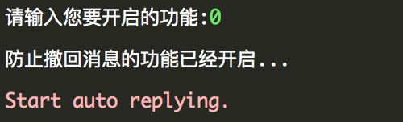
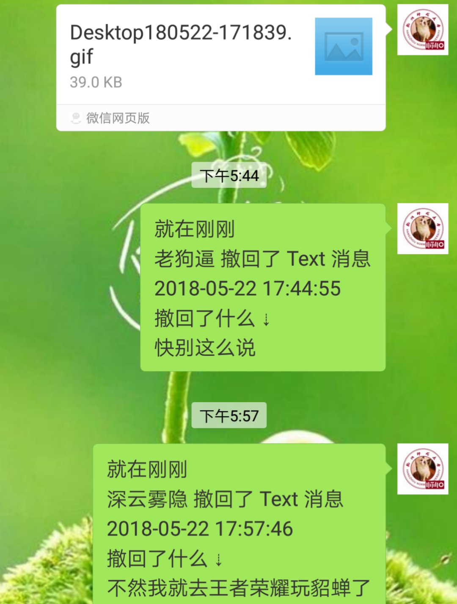
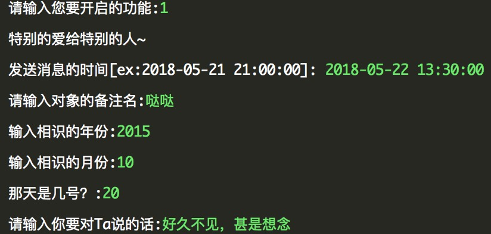

# 微信助手 wxhelper version 1.1.6.20150522_alpha
## 简介:该版本调用python的apscheduler包和itchat实现了防撤回 和 特别的爱❤️给特别的你 两个功能
### 文件介绍
itchat.pkl - 登陆后保持登陆状态的静态文件
img-folder - 保存要用到的图片
Auto_message.py - 特别的爱给特别的人模版文件
Withdraw_message.py - 这部分是消息撤回的代码
wxhelper.py - 主函数
wxhelper.exe - 分装好的可执行程序，目前只有window版本的，后续会补上mac和linux版本的

### 启动的注意事项
双击exe程序，输入一个用于存放微信聊天文件的目录，推荐放在同级目录

### 防撤回功能
输入完路径后会提示选择开启的功能
效果：

### 特别的爱给特别的你

### 后续版本将要实现的功能
1、自定义随机信息发送
2、红包消息提示
3、...
